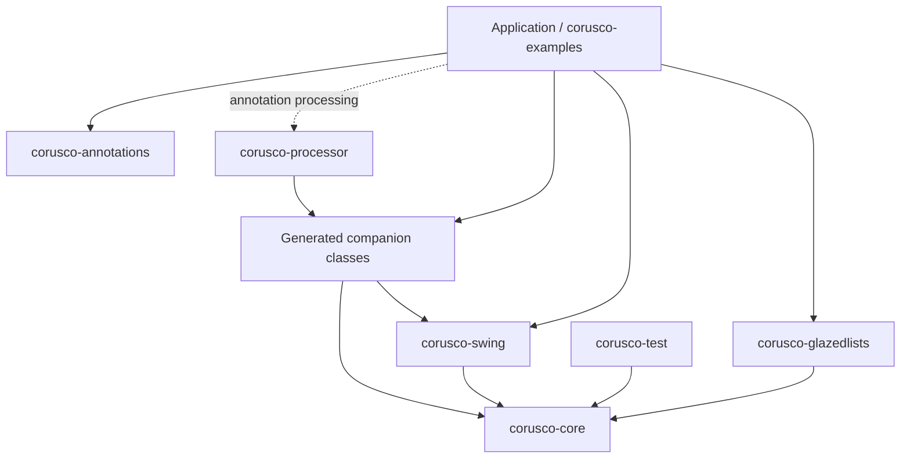

# Corusco Architecture Overview

Corusco is a Swing presentation framework, not a Swing replacement. The runtime
keeps Swing components visible and ordinary, while generated metadata removes
stringly typed wiring, JavaBeans reflection, and scattered UI constants from the
parts of an application that are easiest to break.

The project follows three core ideas:

- immutable edit records and presentation models own form state;
- generated keys and descriptors define contracts between models, views, tables,
  commands, resources, and tests;
- lifecycle scopes own listeners, bindings, behaviors, table controllers, and
  task callbacks so Swing screens can be disposed deterministically.

## Module Layers

| Layer | Modules | Responsibility |
| --- | --- | --- |
| Runtime core | `corusco-core` | Swing-free primitives: lifecycle, observable values/lists, form models, validation, commands, resources, table metadata/state, tasks, and dialog result types. |
| Swing runtime | `corusco-swing` | EDT utilities, Swing bindings, behaviors, collection models, command adapters, table models/controllers, dialog helpers, busy overlays, and MVP test harness. |
| Optional interop | `corusco-glazedlists` | Adapts mature Glazed Lists `EventList` instances to Corusco `ObservableList` row sources. |
| Compile-time API | `corusco-annotations` | Source annotations for forms, tables, actions, help, and simple local constraints. |
| Code generation | `corusco-processor` | Annotation processor that emits typed Java companion classes using `javax.lang.model` APIs instead of reflection. |
| Testing support | `corusco-test` | Internal generated-source compiler helpers and cross-module testing utilities. |
| Examples | `corusco-examples` | Compiling examples and regression fixtures that show the intended usage of each completed roadmap slice. |

Dependencies flow downward from application/example code into runtime modules.
The core module does not depend on Swing, annotations, or the processor. Swing
integration depends on core. Annotation users depend on `corusco-annotations`
at compile time and configure `corusco-processor` as an annotation processor.



## Runtime Flow

A typical form screen follows the same data path whether it is written by hand
or generated from annotations:

```text
domain value
    -> immutable edit record
        -> generated form model
            -> field models, parse state, validation problems, dirty/touched state
        -> generated behavior plan and Swing bindings
            -> visible Swing components
        -> dialog or presenter command
    -> accepted edit record
    -> application service
```

Text input intentionally keeps raw text separate from semantic values. For
example, a decimal field may contain unparseable text while the previous valid
`BigDecimal` remains available. That distinction belongs in the form model, not
in ad hoc Swing listeners.

See [Form Model Guide](forms.md) for handwritten and generated form model
patterns, validation rules, reset, baseline acceptance, and testing.

## Generated Contracts

The processor currently generates companion classes for three source shapes:

- `@CoruscoForm` records: field keys, resources, problems, descriptors, form
  models, view contracts, and behavior plans.
- `@CoruscoTable` records: table keys, column descriptors, resources, row updater
  helpers, table descriptors, model installers, and selection binders.
- `@UiAction` methods: action keys, resource keys, and action descriptors.

Generated code is deliberately direct Java. It calls record accessors,
constructors, method references, descriptor factories, and binding helpers. It
does not scan annotations at runtime, discover JavaBeans properties, or evaluate
property paths.

See [Generated Code Examples](generated-code-examples.md) for the current
annotated example records, generated companions, runtime examples, and review
checklist.

## Keys and IDs

Application code should pass typed keys and descriptors, not raw strings:

- `FieldKey<CustomerEdit, BigDecimal>`
- `TextFieldKey<CustomerEdit, String>`
- `ColumnKey<CustomerRow, Integer>`
- `ActionKey`
- `ComponentKey<JTextField>`
- `ResourceKey<String>`
- `HelpTopic`

String IDs still exist at boundaries such as generated metadata, resource
lookup, diagnostics, and persisted table state. The important rule is that
application APIs exchange typed keys, and generated IDs use stable tokens such
as `customer/name`, not JavaBeans property paths.

## Lifecycle Ownership

Corusco uses small lifecycle scopes instead of a global application container:

- `SubscriptionScope` owns value/list listeners.
- `BindingScope` owns Swing bindings, table controllers, and other disposable
  UI attachments.
- `BehaviorScope` owns installed component behaviors and detects behavior
  conflicts.
- `DetachableScope` owns values that can release expensive backing state between
  requests or screen activations.

This keeps cleanup local to a view, dialog, presenter, or test fixture. A screen
that opens, binds, and closes repeatedly should not leak listeners or background
callbacks.

## Tables

Tables are built from typed descriptors. A descriptor defines the table key,
column keys, resource keys, getter/updater functions, capabilities, default
width/order/visibility, and persistence metadata.

At runtime:

- `ObservableTableModel` adapts `ObservableList` row sources to Swing.
- `TableStateController` maps mutable `JTable` column state back to stable
  persistence IDs.
- `TableHeaderColumnVisibilityMenu` builds column toggles from descriptors.
- `TableSelectionBinding` maps Swing view selection back to model rows.
- Glazed Lists interop can provide the observable row source when applications
  already use `EventList` pipelines.

See [Table Guide](tables.md) for generated table records, Glazed Lists row
sources, selection binding, table-state migration, visibility menus, and
testing patterns.

## Behaviors and Commands

Behaviors are attachable component extensions. They install listeners, input-map
entries, visual decoration, help hooks, tooltip handling, command wiring, and
validation feedback under an explicit `BehaviorScope`.

Commands are presentation objects identified by `ActionKey`. Swing buttons,
menu items, toolbar entries, key bindings, and tests should share the same
command instance instead of maintaining parallel enabled/selected state.

See [Behavior Authoring Guide](behaviors.md) for behavior phases, descriptors,
cleanup rules, and custom behavior examples.
See [Command and Action Guide](commands.md) for generated action descriptors,
presenter-owned command state, Swing action adapters, and command testing
patterns.
See [Dialog Guide](dialogs.md) for transactional form-dialog controllers,
typed results, dirty-cancel confirmation, validation summaries, keyboard
bindings, and dialog lifecycle ownership.

## Testing Strategy

Runtime tests exercise values, lists, form models, validation, commands,
bindings, behaviors, tables, dialogs, and async helpers directly. Swing tests use
EDT-aware utilities and `SwingMvpTester` so presenter tests interact through
generated keys rather than private fields.

Processor tests compile sample sources with `GeneratedSourceCompiler` and then
assert generated sources with normalized line endings. This keeps generator
regressions visible without making every processor test reimplement javac setup.

See [Testing Guide](testing.md) for Swing MVP tests, generated-source compiler
tests, example regression tests, and local verification commands.

## Current Limits

The project is in the `1.0.0` release line. The following areas remain
candidates for future releases:

- generated-source compatibility checks beyond the runtime binary gate;
- any optional legacy reflection adapter.

Local Maven publication, source/Javadoc artifacts, JPMS module names, and the
compatibility policy are now documented in [Release Policy](release-policy.md).

The active rule remains the same: keep runtime APIs typed and explicit, keep
generated code readable, and keep Swing behavior observable to an experienced
Swing developer.
